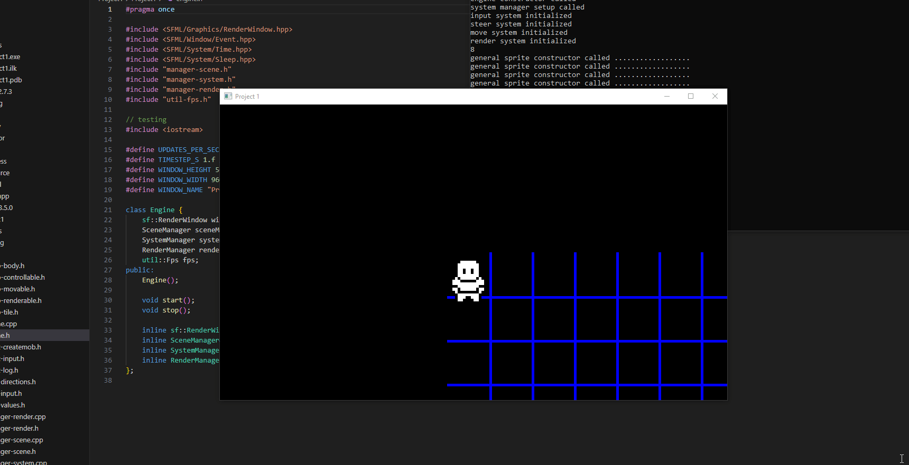

# Game Engine in C++ POC
Unfinished 2D game engine started in 2018 using:
- [EnTT](https://github.com/skypjack/entt) for the Entity-Component-System architecture
- [SFML](https://www.sfml-dev.org/) for input and graphics

The objective was to learn more about ECS and memory-safe C++ (smart-pointers, rule of 3/5/0, etc).

